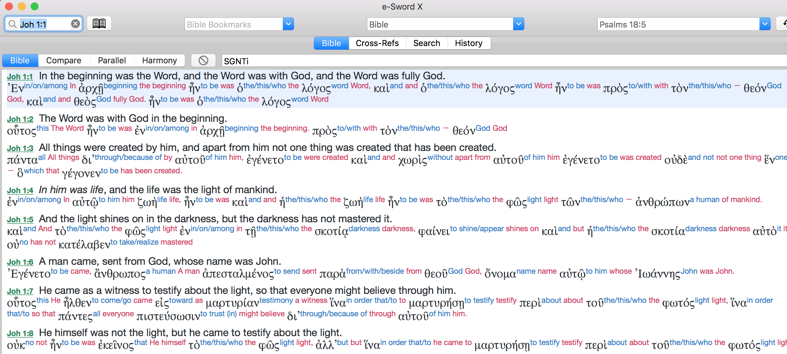

# Upgraded to Version 3

<b>25 August 2018:</b> The base text of OpenGNT project had been upgraded to version 3.  Previous versions, 1 & 2, are no longer supported.

There are 2 major files: 
- Base Text of OGNT: <a href='https://github.com/eliranwong/OpenGNT/blob/master/OpenGNT_BASE_TEXT.zip'>OpenGNT_BASE_TEXT.zip</a>
- Keyed Features and Mapping IDs: <a href='https://github.com/eliranwong/OpenGNT/blob/master/OpenGNT_keyedFeatures.csv.zip'>OpenGNT_keyedFeatures.csv.zip</a>

The base text of OpenGNT project, OGNT, is currently the closest equivalent to the text of NA28.

The base text and the rest of Open Greek New Testament Project is released under a public license described below.

Comparison between OGNT and NA28 is briefly described <a href='https://github.com/eliranwong/OpenGNT/tree/master/mapping_BGB/compare_OGNT_NA28'>HERE</a>.

# Open Greek New Testament Project

Open Greek New Testament project aims to provide a bundle of high-quality and open-source materials on Greek New Testament for biblical studies.
  
An eclectic text, namely "Open Greek New Testament [OGNT]", is first produced as the base text for the rest of the project.  The text of OPNT is built upon a group of high-quality scholarly materials</a>.  This aims to provide all bible students or scholars <b>a free text</b>, which is <a href='https://github.com/eliranwong/OpenGNT/tree/master/CompareOGNTwithNA28'><b>the closest equivalent to the text of NA28</b></a>, for studies or research purposes.

# License:

The main text of Open Greek New Testament Project, OGNT in short, is release under the following license:

 Open Greek New Testament Project by <a xmlns:cc="http://creativecommons.org/ns#" href="https://BibleBento.com" property="cc:attributionName" rel="cc:attributionURL">Eliran Wong</a> is licensed under a <a rel="license" href="http://creativecommons.org/licenses/by-nc-sa/4.0/">Creative Commons Attribution-NonCommercial-ShareAlike 4.0 International License</a>. Based on a work at <a xmlns:dct="http://purl.org/dc/terms/" href="https://github.com/eliranwong/OpenGNT" rel="dct:source">https://github.com/eliranwong/OpenGNT</a>. Permissions beyond the scope of this license may be available at <a xmlns:cc="http://creativecommons.org/ns#" href="https://biblebento.com/contact/contactform.php" rel="cc:morePermissions">https://biblebento.com/contact/contactform.php</a>.

You are allowed to use, adapt and distribute OpenGNT materials for non-commercial purpose only.  Commercial use is NOT granted with the license stated above.  You may <a href='https://biblebento.com/contact/contactform.php'>email</a> to ask for use in commercial project.
  
You are required to quote the following information, when any parts of OpenGNT materials are integrated in your own work or distributed:
  
<b>Open Greek New Testament Project</b> 
Developer: Eliran Wong [<a href='https://biblebento.com/contact/contactform.php' target='_blank'>Contact</a>; <a href='https://biblebento.com/' target='_blank'>BibleBento.com</a>], 
Source at <a href='https://github.com/eliranwong/OpenGNT' target='_blank'>https://github.com/eliranwong/OpenGNT/</a>

# Source: A brief History 

<b>From Nestle (1904) to OpenGNT</b>

The latest base text of Open Greek New Testament Project, OGNT in short, was compiled from Berean Greek Bible and its associated database, which is primarily based on the Greek New Testament, <a href='https://sites.google.com/site/nestle1904/'>Η ΚΑΙΝΗ ΔΙΑΘΗΚΗ</a>, edited by Eberhard Nestle, published in 1904 by the British and Foreign Bible Society.

The Greek New Testament (Nestle, 1904) is now a public domain document worldwide, without any limitations for use or copyright issues.  <a href='https://berean.bible/committee.htm'>The Berean Bible Translation Committee</a> adopted it years ago as the base text for developing Berean Greek Bible and associated resources on New Testament.  

The final text of <a href='https://greekbible.org'>Berean Greek Bible</a> is primary based on Nestle Greek New Testament (1904), with standardisation of spellings and textual decisions reflecting the best and earliest manuscripts.  In addition, Berean translation table marks some significant textual variants of popular critical Greek New Testament editions, with <a href='https://greekbible.org'>a set of symbols</a>.

In August, 2018, Eliran Wong [<a href='https://biblebento.com'>BibleBento.com</a>] received permission from John Isett [<a href='https://biblehub.com'>BibleHub.com</a>] to integrate Berean Greek Bible and its associated data into Open Greek New Testament Project, for compilation, mapping resources and distribution.

As the original Greek New Testament (Nestle, 1904) is akin to recent editions of NA texts (e.g. NA27, NA28), Berean Greek data soon became obvious to be a very good source for compiling a base text for use in Open Greek New Testament Project, for further mapping valuables resources based on NA27 / NA28.

<b>Compilation of the base text of OGNT</b>

Berean Greek Bible and its associated data were then taken into review and processed, for compilation of a NA-equivalent Greek New Testament.  The process of compilation is briefly described below:

- Variants markers were reviewed, a few were refined.
- Three missing variants from Byzantine text were added to the database.
- <a href='https://github.com/greekcntr/BHP'>Bunning Heuristic Prototype Greek New Testament</a>, BHP in short, released by <a href='https://greekcntr.org'>Center for New Testament Restoration</a>, was compared in the review process.  BHP was taken into weighing textual decisions, as it reflects the latest efforts to reflect the best and earliest manuscripts.  BHP was not considered in the development of Berean Greek Bible, because it had not been published at the first launch of Berean Greek Bible.  The result is that two textual variants, taken from the text of BHP, were added to the database.
- Berean Greek Bible uses KJV versification.  Mapping data to original GNT's versification (Nestle 1904).  Minor variations follows the versification of SBLGNT.
- Punctuation marks adapts data provided in <a href='https://github.com/tyndale/STEPBible-Data'>TANTT - Tyndale Amalgamated NT Tagged texts</a>.  OpenGNT project further places punctuation marks into two groups, i.e. those preceding a word and those following a word.

<b>Transparency</b>

- To ensure transparency, the original database for compilation, including Berean Greek Data, and additional data mentioned above, is uploaded <a href='https://github.com/eliranwong/OpenGNT/blob/master/mapping_BGB/source_BereanGreekBible_Inclusive.csv.zip'>HERE</a>.
- The process of the compilation is repeatable through the use of a simple Python script uploaded <a href='https://github.com/eliranwong/OpenGNT/blob/master/mapping_BGB/script/compileOGNT.py'>HERE</a>.  The script is provided for the sake of transparency.  In addition, it may be useful for validation or checking.

Usage of the script:
- unzip file "source_BereanGreekBible_Inclusive.csv.zip"
- places files "berean_tablesInclusive.csv" and "compileOGNT.py" in the same folder
- run command "python compileOGNT.py"

<b>Result and Comparison with NA28</b>

The resulting text is suprisingly very close to the text of NA28.  The latest version (version 3).  It only has 111 words different from from the text of NA28.  It is not only the closest equivalent to the text of NA28 / NA27, but also the best candidate, apart from copyrighted NA28 / NA27, for mapping resources originally keyed to NA28 / NA27, e.g. OpenText Linguistic Annotations, Levinsohn Greek New Testament discourse features.

Comparison between OGNT and NA28 is briefly described <a href='https://github.com/eliranwong/OpenGNT/tree/master/mapping_BGB/compare_OGNT_NA28'>HERE</a>.

# Screenshot:

Some of the description below are written about previous versions, i.e. versions 1 & 2, and therefore outdated.  All description and documentation will be updated soon.

# Main File:

"<a href='https://github.com/eliranwong/OpenGNT/blob/master/OpenGNT.csv.zip'>OpenGNT.csv.zip</a>" is currently the main file for practical use. [<i>Remarks: Unzip the file before using it.</i>]
  
It gives users a quick access to the main text of OpenGNT, keyed to various features.
  
<a href='https://github.com/eliranwong/OpenGNT/blob/master/OpenGNT.csv.zip'>This main text of OGNT </a> is currently <a href='https://github.com/eliranwong/OpenGNT/tree/master/CompareOGNTwithNA28'><b>the closest equivalent to the text of NA28</b></a>, made available for distribution under an open-license.
  
File format:
- each word of the main text is placed on a single line. 
- each line starts with a sort number in the whole text, followed by two different versions of mapping id (i.e. "mapIDV2" & "mapIDV1"), separated from one another by a [TAB] character, 
- followed by different groups of data, separated one another by a [TAB] character: 
 
- <b>Gropu I - Bible Reference</b>:  
〔book｜chapter｜verse〕 
1) Book number 
2) Chapter number 
3) Verse number 
 
- <b>Gropu II - Main text of OpenGNT</b>:  
〔unaccentedWord｜accentedWordV1｜accentedWordV2｜transliteration｜modernPronunciation〕 
1) unaccentedWord = Unaccented Word 
2) accentedWordV1 = Accented Word (version 1) - <a href='https://github.com/eliranwong/OpenGNT/tree/master/From_TANTT_to_OpenGNT'>details HERE</a> 
3) transliteration = Transliteration 
4) modernPronunciation = Modern Greek Pronunciation 
 
- <b>Gropu III - Punctuation Marks</b>:  
〔puncMpWv1｜puncMfWv1｜puncMpWv2｜puncMfWv2〕 
1) puncMpWv1 = Punctuation mark(s), which precede(s) the main word (version 1) 
2) puncMfWv1 = Punctuation mark(s), which follow(s) the main word (version 1) 
 
- <b>Gropu IV - Mapping to OpenText.org Data</b>:  
〔OpenTextWordID〕 
1) <b>OpenTextWordID</b> - Base Word IDs for for mapping <a href='https://github.com/OpenText-org/GNT_annotation_v1.0' target='_blank'>OpenText.org Linguisitc Annotation of the Greek New Testament</a>'s data  (Remarks: OpenText's GNT annotations places shorter ending of Mark 16 at the end of Mark 16:8 whereas OpenGNT places it at the end of Mark 16:20)  
- <b>Gropu V - Mapping to Levinsohn GNTDF's Data</b>:  
〔LevinsohnWordID｜noteMarker｜noteMarkerNoClause｜clause｜otQuotation｜reportedSpeech｜embeddedReportedSpeech〕 
1) <b>LevinsohnWordID</b> - Word IDs for mapping <a href='https://github.com/biblicalhumanities/levinsohn' target='_blank'>Levinsohn's GNT Discourse Features</a>  <b>Full mapping is available in the file <a href='https://github.com/eliranwong/OpenGNT/blob/master/mapping_LevinsohnGNTDF/OGNT_FullMapping_Levinsohn.csv.zip'>OGNT_FullMapping_Levinsohn.csv.zip</a>.</b>  (Remarks: Levinsohn's GNT Discourse Features places shorter ending of Mark 16 at the end of Mark 16:8 whereas OpenGNT places it at the end of Mark 16:20) 
2) <b>noteMarker</b> - Note marker, mapped to <a href='https://github.com/eliranwong/OpenGNT/blob/master/mapping_LevinsohnGNTDF/Levinsohn_notes.csv'>notes of Levinsohn's GNT Discourse Features</a> 
3) <b>noteMarkerNoClause</b> - Note marker, mapped to <a href='https://github.com/eliranwong/OpenGNT/blob/master/mapping_LevinsohnGNTDF/Levinsohn_notes_withoutClauses.csv'>notes of Levinsohn's GNT Discourse Features [without clauses]</a> 
4) <b>clause</b> - Clause markers, according to Levinsohn's GNT Discourse Features 
5) <b>otQuotation</b> - Old Testament Quotations, according to Levinsohn's GNT Discourse Features [<ot> means "beginning of an OT quotation"; * means a word within an OT quotation; </ot> means "end of an OT quotation"; the slot is empty where it is not applicable. 
6) <b>reportedSpeech</b> - Reported speech, according to Levinsohn's GNT Discourse Features [<rs> means "beginning of a reported speech"; * means a word within a reported speech; </rs> means "end of a reported speech"; the slot is empty where it is not applicable. 
7) <b>embeddedReportedSpeech</b> - Embedded reported speech, according to Levinsohn's GNT Discourse Features [<ers> means "beginning of an embedded reported speech"; * means a word within an embedded reported speech; </ers> means "end of an embedded reported speech"; the slot is empty where it is not applicable. 
 
- <b>Gropu VI - Lexical Entries & Morphology</b>:  
〔lexeme｜BDAGentry｜EDNTentry｜MounceEntry｜morphologyCode｜morphologyDescription｜extendedStrongNumber｜GoodrickKohlenbergerNumbers｜LN-LouwNidaNumbers〕 
1) <b>lexeme</b> - lexeme 
2) <b>BDAGentry</b> - BDAG catchwords 
3) <b>EDNTentry</b> - EDNT catchwords 
4) <b>MounceEntry</b> - Entry words of <a href='https://github.com/billmounce/dictionary'>Mounce's Concise Greek-English dictionary</a> 
5) <b>morphologyCode</b> - Robinson's Morphological Analysis Codes [RMAC] 
6) <b>morphologyDescription</b> - description on morphology 
7) <b>extendedStrongNumber</b> - Tyndale House's extended Strong's number 
8) <b>GoodrickKohlenbergerNumbers</b> - Goodrick-Kohlenberger numbers; compatible with <a href='https://github.com/billmounce/dictionary'>Mounce's Concise Greek-English dictionary</a> 
9) <b>LouwNidaNumbers</b> - Louw-Nida numbers  
- <b>Gropu VII - Gloss & Translation</b>:  
〔MounceGloss｜TyndaleHouseGloss｜OpenGNTGloss｜NET2Words〕 
1) <b>MounceGloss</b> - English glosses (Context-<b>insensitive</b>) - 
English glosses selected from <a href='https://github.com/billmounce/dictionary'>Mounce's Concise Greek-English dictionary</a> 
2) <b>TyndaleHouseGloss</b> - English glosses (Context-<b>insensitive</b>) - 
Generated from glosses of TBESG, produced by Tyndale House, Cambridge UK 
3) <b>OpenGNTGloss</b> - English glosses (Context-<b>sensitive</b>) - 
A full set of context-sensitive glosses for OpenGNT, worked out by Eliran Wong [initial data are drawn from "TyndaleHouseGloss" mentioned above; every gloss will be checked against its context; on-going updates are gradually integrated <a href='https://github.com/eliranwong/OpenGNT/blob/master/OpenGNT.csv.zip'>HERE</a>; please check regularly] 
4) <b>NET2Words</b> - Words of The NET Bible® verse text (no Notes; 2nd Edition), mapped to OGNT [1st draft uploaded; subject to on-going revision]  
<a href='https://github.com/eliranwong/OpenGNT/blob/master/README.md#enhancement--forthcoming-additions'>Enhanced features</a> are gradually integrated in <a href='https://github.com/eliranwong/OpenGNT/blob/master/OpenGNT.csv.zip'>this file</a>.
  
- <b>Gropu VIII - Textual Variants</b>:  
〔editionMarker1｜editionMarker2｜editions｜variants〕 
1) <b>editionMarker1</b> - a type of marker for details of editions, used in applications, e.g. BibleBento Plus 
2) <b>editionMarker2</b> - a type of marker for details of editions, used in applications, e.g. e-Sword 
3) <b>editions</b> - GNT editions having the same spelling as the main word of OpenGNT.  There may be variation in accentuation or capitalisation, though.  [B=Byzantine, I=NIV Greek, N=NA27, M=NA28 where words are different from NA27, R=Textus Receptus, S=SBLGNT, T=<a href='http://www.tyndalehouse.com/tregelles/' target='_blank'>Tregelles's GNT</a>, W=Westcott-Hort, H=<a href='https://www.thegreeknewtestament.com' target='_blank'>Tydale House GNT</a>] 
4) <b>variants</b> - variant(s), if any  
- <b>The last column - WordInHTML</b>:  
This last column provide words of OGNT in html format, with taggings on extended Strong's numbers, morphology, ot quotation [ot.../ot], reported speech [rs.../rs], embedded reported speech [ers.../ers], textual variant marker, Levinsohn's clause division & note marker, if applicable.  
<b><i>Remarks:</i></b> 
- Lines / Entries starting with the following numbers are created for mapping purpose only (mapping resouces based on NA27, e.g. Levinsohn Discource Features): 
122580, 122586, 122796, 123928, 123948, 124712, 125108, 125238, 127544, 127800, 128058, 128061. 
These lines may not be relevant to compilation of the main text of OGNT.

# License:

The main text of Open Greek New Testament Project, OGNT in short, is release under the following license:

 Open Greek New Testament Project by <a xmlns:cc="http://creativecommons.org/ns#" href="https://BibleBento.com" property="cc:attributionName" rel="cc:attributionURL">Eliran Wong</a> is licensed under a <a rel="license" href="http://creativecommons.org/licenses/by-nc-sa/4.0/">Creative Commons Attribution-NonCommercial-ShareAlike 4.0 International License</a>. Based on a work at <a xmlns:dct="http://purl.org/dc/terms/" href="https://github.com/eliranwong/OpenGNT" rel="dct:source">https://github.com/eliranwong/OpenGNT</a>. Permissions beyond the scope of this license may be available at <a xmlns:cc="http://creativecommons.org/ns#" href="https://biblebento.com/contact/contactform.php" rel="cc:morePermissions">https://biblebento.com/contact/contactform.php</a>.

  
You are allowed to use, adapt and distribute OpenGNT materials for non-commercial purpose only.  Commercial use is NOT granted with the license stated above.  You may <a href='https://biblebento.com/contact/contactform.php'>email</a> to ask for use in commercial project.
  
You are required to quote the following information, when any parts of OpenGNT materials are integrated in your own work or distributed:
  
<b>Open Greek New Testament Project</b> 
Developer: Eliran Wong [<a href='https://biblebento.com/contact/contactform.php' target='_blank'>Contact</a>; <a href='https://biblebento.com/' target='_blank'>BibleBento.com</a>], 
Source at <a href='https://github.com/eliranwong/OpenGNT' target='_blank'>https://github.com/eliranwong/OpenGNT/</a>
  
[Remarks: Please include all links available in the credit information above.]
  
<b>Other Credits / Attributions:</b>
  
<b>TANTT data</b>: 
"Tyndale House, Cambridge" [<a href='www.TyndaleHouse.com' target='_blank'>www.TyndaleHouse.com</a>], 
and "STEP Bible" [<a href='www.STEPBible.org' target='_blank'>www.STEPBible.org</a>] 
and source at <a href='tyndale.github.io/STEPBible-Data/' target='_blank'>tyndale.github.io/STEPBible-Data/</a>
  
<b>Berean Interlinear Bible</b> 
The Holy Bible, <a href='https://interlinearbible.com'>Berean Interlinear Bible</a>, BIB 
Copyright ©2016, 2018 by Bible Hub 
Used by Permission. All Rights Reserved Worldwide. 
//<a href='berean.bible'>berean.bible</a> - Berean Bible Homepage 
//<a href='interlinearbible.com'>interlinearbible.com</a> - Berean Interlinear Bible 
//<a href='literalbible.com'>literalbible.com</a> - Berean Literal Bible 
//<a href='bereanbible.com'>bereanbible.com</a> - Berean Study Bible 
//<a href='emphasizedbible.com'>emphasizedbible.com</a> - Berean Emphasized Bible
  
<b>The OpenText.org Syntactically Annotated Greek New Testament</b> 
Stanley E. Porter 
Matthew Brook O'Donnell 
Jeffrey T. Reed 
Source: <a href='https://github.com/OpenText-org/GNT_annotation_v1.0' target='_blank'>GNT Annotation (version 1.0)</a> 
This annotation was completed in 2006 and was made available for viewing on the OpenText.org website and also implemented in Logos bible search software. 
The annotation data has been migrated to a new, inline XML format by Christopher Land and the base text has been corrected and updated to the NA28 by Christopher Land and Ryder Wishart.
  
<b>Levinsohn's Greek New Testament Discourse Features</b> 
Stephen Levinsohn's complete discourse features markup of the Greek New Testament (UBS4/NA27). This data was originally developed in BART and follow principles Levinsohn documented in his volume of Discourse Features of New Testament Greek. 
Source: <a href='https://github.com/biblicalhumanities/levinsohn'>https://github.com/biblicalhumanities/levinsohn</a> 
©2016 SIL International 
<a href='https://github.com/biblicalhumanities/levinsohn/blob/master/LICENSE.md'>License</a> 
Released by: 
Paul O'Rear 
Associate Coordinator 
International Translation 
SIL International
  
<b>NET Bible Copyright 2nd Edition (2017)</b> 
NET BIble® Copyright THE NET BIBLE®, New English Translation (NET) Scripture quoted by permission. Quotations designated (NET) are from the NET Bible® copyright ©1996-2016 by Biblical Studies Press, L.L.C. <a href='http://netbible.com' target='_blank'>http://netbible.com</a> All rights reserved.  The names: THE NET BIBLE®, NEW ENGLISH TRANSLATION COPYRIGHT (c) 1996 BY BIBLICAL STUDIES PRESS, L.L.C. NET Bible® IS A  REGISTERED TRADEMARK THE NET BIBLE® LOGO, SERVICE MARK COPYRIGHT (c) 1997 BY BIBLICAL STUDIES PRESS, L.L.C. ALL RIGHTS RESERVEDSATELLITE IMAGERY COPYRIGHT (c) RØHR PRODUCTIONS LTD. AND CENTRE NATIONAL D'ÉTUDES SPATIALES PHOTOGRAPHS COPYRIGHT (c) RØHR PRODUCTIONS LTD.
 
The NET Bible® verse text (no Notes) can be used by anyone and integrated into your non-commercial  project or publication upon condition of proper Biblical Studies Press copyright and organizational acknowledgments ... (<a href='http://netbible.com/net-bible-copyright' target='_blank'>http://netbible.com/net-bible-copyright</a>)
  
<b>Mounce Concise Greek-English Dictionary</b> 
Source: <a href='https://github.com/billmounce/dictionary'>https://github.com/billmounce/dictionary</a> 
Used with the following attribution: 
Mounce Concise Greek-English Dictionary 
Copyright 1993 All Rights Reserved 
www.teknia.com/greek-dictionary
  
<b>Morphological Lexicon of the Greek New Testament</b> 
Source: <a href='https://github.com/morphgnt/morphological-lexicon'>https://github.com/morphgnt/morphological-lexicon</a> 
It is used to process data for mapping purpose. 

# Sources:

The base text of OpenGNT project, OGNT in short, is largely developed from a scholarly database, "TANTT - Tyndale Amalgamated NT Tagged texts".
  
Read in folder "<a href='https://github.com/eliranwong/OpenGNT/tree/master/From_TANTT_to_OpenGNT'>From_TANTT_to_OpenGNT</a>" for an introduction of TANTT and additional content, introduced by OpenGNT. 

# Comparison between OpenGNT and NA28

Read more in folder "<a href='https://github.com/eliranwong/OpenGNT/tree/master/CompareOGNTwithNA28'>CompareOGNTwithNA28</a>"

# Enhancement / Forthcoming additions:

- transliteration (according to SBL guide) - <a href='https://github.com/eliranwong/OpenGNT/blob/master/OpenGNT.csv.zip'>DONE!</a> 
- modern Greek pronunciation guide - <a href='https://github.com/eliranwong/OpenGNT/blob/master/OpenGNT.csv.zip'>DONE!</a> 
- an analytical lexicon containing all words of OpenGNT text - <a href='https://github.com/eliranwong/OpenGNT/blob/master/Lexicons/OGNT-Analytical_Lexicon.csv'>DONE!</a> 
- a full set of context-sensitive glosses for OpenGNT [<a href='https://github.com/eliranwong/OpenGNT/blob/master/OpenGNT.csv.zip'>Find regular updates HERE</a>; read file description <a href='https://github.com/eliranwong/OpenGNT/blob/master/README.md#main-file'>HERE</a>.]
- mapping GK numbers (mapped with <a href='https://github.com/billmounce/dictionary'>Mounce's Concise Greek-English dictionary</a>) - <a href='https://github.com/eliranwong/OpenGNT/blob/master/OpenGNT.csv.zip'>First draft; CHECKING in progress</a> 
- mapping Louw-Nida numbers (numbers only, not copyrighted materials) - <a href='https://github.com/eliranwong/OpenGNT/blob/master/OpenGNT.csv.zip'>First draft; CHECKING in progress</a> 
- mapping BDAG catchwords (catchwords only, not copyrighted materials) - <a href='https://github.com/eliranwong/OpenGNT/blob/master/OpenGNT.csv.zip'>First draft; CHECKING in progress</a> 
- mapping EDNT catchwords (catchwords only, not copyrighted materials) - <a href='https://github.com/eliranwong/OpenGNT/blob/master/OpenGNT.csv.zip'>First draft; CHECKING in progress</a> 
- mapping <a href='https://github.com/billmounce/dictionary' target='_blank'>Mounce's NT dictionary</a> - <a href='https://github.com/eliranwong/OpenGNT/blob/master/OpenGNT.csv.zip'>DONE!</a> 
- mapping <a href='https://github.com/OpenText-org/GNT_annotation_v1.0' target='_blank'>OpenText annotations</a> - <a href='https://github.com/eliranwong/OpenGNT/blob/master/OpenGNT.csv.zip'>DONE!</a> 
- creating a html template for visual presentation of OpenText annotations - <a href='https://github.com/eliranwong/OpenGNT/blob/master/mapping_OpenTextAnnotations/OpenText_v1_formatted_in_HTML.csv.zip'>DONE!</a> 
- mapping <a href='https://github.com/biblicalhumanities/levinsohn' target='_blank'>Levinsohn's GNT Discourse Features</a> - <a href='https://github.com/eliranwong/OpenGNT/blob/master/OGNT_FullMapping_Levinsohn.csv.zip'>DONE!</a>; Full mapping is availalbe <a href='https://github.com/eliranwong/OpenGNT/blob/master/mapping_LevinsohnGNTDF/OGNT_FullMapping_Levinsohn.csv.zip'>HERE</a> 
- tagging the text of OGNT with <a href='https://github.com/eliranwong/OpenGNT/blob/master/mapping_LevinsohnGNTDF/OGNT_FullMapping_Levinsohn.csv.zip'>Levinsohn GNT discourse features</a>, like <a href='https://github.com/biblicalhumanities/levinsohn/blob/master/LGNTDF/Main_clauses.xml'>main clauses</a>, <a href='https://github.com/biblicalhumanities/levinsohn/blob/master/LGNTDF/OT_quotes.xml'>OT quotations</a>, <a href='https://github.com/biblicalhumanities/levinsohn/blob/master/LGNTDF/Reported_Speech.xml'>reported speeches</a>, <a href='https://github.com/biblicalhumanities/levinsohn/blob/master/LGNTDF/EmbeddedRepSpeech.xml'>embedded reported speeches</a>, etc. - <a href='https://github.com/eliranwong/OpenGNT/blob/master/OpenGNT.csv.zip'>DONE!</a> 
- mapping <a href='https://interlinearbible.com'>Berean Greek Bible</a> and its associated data - in progress 
- mapping "<a href='http://netbible.com/' target='_blank'>The NET Bible® verse text (no Notes) - 2nd Edition; New Testament</a>" (1st draft uploaded <a href='https://github.com/eliranwong/OpenGNT/blob/master/OGNT_FullMapping_Levinsohn.csv.zip'>HERE</a>; subject to on-going revision) 
- mapping "Chinese Union Version" 
- more ... you are welcome to make suggestions at <a href='https://biblebento.com/contact/contactform.php' target='_blank'>https://biblebento.com/contact/contactform.php</a>

# Modules for Software Applications

Modules based on OpenGNT project are released gradually for use with bible applications.  They are made available in folder "<a href='https://github.com/eliranwong/OpenGNT/tree/master/Modules_for_Bible_Applications'>Modules_for_Bible_Applications</a>"
  
If you are a software developer and interested in this project, you are welcomed to contact <a href='https://biblebento.com/contact/contactform.php' target='_blank'>Eliran Wong</a>.
  

