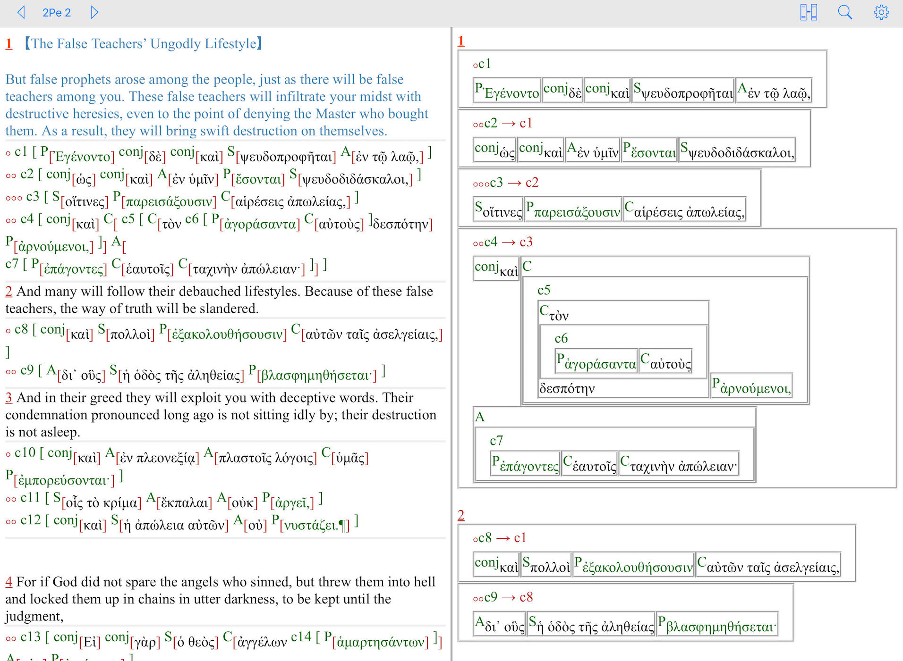

# OpenGNT
NA28 / NA27 Equivalent; Open Greek New Testament Resources

# Open Greek New Testament Project

Open Greek New Testament project aims to provide a bundle of high-quality and open-source materials on Greek New Testament for biblical studies.
  
An eclectic text, namely "Open Greek New Testament [OGNT]", is first produced as the base text for the rest of the project.  The text of OPNT is built upon <a href='https://github.com/eliranwong/OpenGNT/tree/master/From_TANTT_to_OpenGNT'>a group of high-quality scholarly materials</a>.  This aims to provide all bible students or scholars <b>a free text</b>, which is <a href='https://github.com/eliranwong/OpenGNT/tree/master/CompareOGNTwithNA28'><b>the closest equivalent to the text of NA28</b></a>, for studies or research purposes.

# Screenshot:

# Main File:

"<a href='https://github.com/eliranwong/OpenGNT/blob/master/OpenGNT.csv.zip'>OpenGNT.csv.zip</a>" is currently the main file for practical use. [<i>Remarks: Unzip the file before using it.</i>]
  
It gives users a quick access to the main text of OpenGNT, keyed to Tyndale House' extended Strong's numbers and glosses, James Tauber's morphology, and variant markers on nine modern editions of Greek New Testament (i.e. B=Byzantine, I=NIV Greek, N=NA27, M=NA28 where words are different from NA27, R=Textus Receptus, S=SBLGNT, T=<a href='http://www.tyndalehouse.com/tregelles/' target='_blank'>Tregelles's GNT</a>, W=Westcott-Hort, H=<a href='https://www.thegreeknewtestament.com' target='_blank'>Tydale House GNT</a>).
  
<a href='https://github.com/eliranwong/OpenGNT/blob/master/OpenGNT.csv.zip'>This text</a> is currently <a href='https://github.com/eliranwong/OpenGNT/tree/master/CompareOGNTwithNA28'><b>the closest equivalent to the text of NA28</b></a>, made available for distribution under an open-license.
  
File format:
- each word of the main text is placed on a single line. 
- each line starts with an order number in the whole text, followed by an order number in a single verse, an unique OpenGNT id, book number, chapter number and verse number, separated from each other by a [TAB] character. 
- the last column contain all current features in the following order: 
1) Base WordID for for mapping <a href='https://github.com/OpenText-org/GNT_annotation_v1.0' target='_blank'>OpenText.org Linguisitc Annotation of the Greek New Testament</a>'s data 
2) editions having the same word [B=Byzantine, I=NIV Greek, N=NA27, M=NA28 where words are different from NA27, R=Textus Receptus, S=SBLGNT, T=<a href='http://www.tyndalehouse.com/tregelles/' target='_blank'>Tregelles's GNT</a>, W=Westcott-Hort, H=<a href='https://www.thegreeknewtestament.com' target='_blank'>Tydale House GNT</a>] 
3) unaccented word 
4) accented word 
5) transliteration 
6) modern pronunciation 
7) Tyndale House's extended Strong's number 
8) morphology code 
9) description on morphology 
10) lemma 
11) Tyndale House's English gloss 
12) Louw-Nida numbers 
13) Goodrick-Kohlenberger numbers 
14) BDAG catchwords 
15) EDNT catchwords 
16) variant(s), if any
  
<a href='https://github.com/eliranwong/OpenGNT/blob/master/README.md#enhancement--forthcoming-additions'>Enhanced features</a> are gradually integrated in this file.
  
<i>Remarks:</i> Lines / Entries starting with the following numbers are created for mapping purpose only:
48749, 81630, 93287, 100516, 105053o.

# License:

All files produced by this project are released under <a href='https://creativecommons.org/licenses/by-nd/4.0/legalcode' target='_blank'>CC BY-NC-ND 4.0 with additional specified relaxations</a>
  
You are allowed to use or distribute OpenGNT materials for non-commercial purpose (formatting is allowed, without changes in mapping data).
  
You are required to quote the following information, when any parts of OpenGNT materials are integrated in your own work or distributed:
  
Open Greek New Testament Project 
Developer: Eliran Wong [<a href='https://biblebento.com/contact/contactform.php' target='_blank'>Contact</a>; <a href='https://biblebento.com/' target='_blank'>BibleBento.com</a>], 
Source at <a href='https://github.com/eliranwong/OpenGNT' target='_blank'>https://github.com/eliranwong/OpenGNT/</a>
  
Credits of original TANTT data:
  
"Tyndale House, Cambridge" [<a href='www.TyndaleHouse.com' target='_blank'>www.TyndaleHouse.com</a>], 
and "STEP Bible" [<a href='www.STEPBible.org' target='_blank'>www.STEPBible.org</a>] 
and source at <a href='tyndale.github.io/STEPBible-Data/' target='_blank'>tyndale.github.io/STEPBible-Data/</a>
  
[Remarks: Please include all links available in the credit information above.]

# Sources:

The base text of OpenGNT project, OGNT in short, is largely developed from a scholarly database, "TANTT - Tyndale Amalgamated NT Tagged texts".
  
Read in folder "<a href='https://github.com/eliranwong/OpenGNT/tree/master/From_TANTT_to_OpenGNT'>From_TANTT_to_OpenGNT</a>" for an introduction of TANTT and additional content, introduced by OpenGNT. 

# Comparison between OpenGNT and NA28

Read more in folder "<a href='https://github.com/eliranwong/OpenGNT/tree/master/CompareOGNTwithNA28'>CompareOGNTwithNA28</a>"

# Enhancement / Forthcoming additions:

- transliteration (according to SBL guide) - <a href='https://github.com/eliranwong/OpenGNT/blob/master/OpenGNT.csv.zip'>DONE!</a> 
- modern Greek pronunciation guide - <a href='https://github.com/eliranwong/OpenGNT/blob/master/OpenGNT.csv.zip'>DONE!</a> 
- an analytical lexicon containing all words of OpenGNT text - <a href='https://github.com/eliranwong/OpenGNT/blob/master/Enhancement/OpenGNT-Analytical_Lexicon.csv'>DONE!</a> 
- sub-meanings on 5594 occurrences of αὐτός [he/she/it/self] - <a href='https://github.com/eliranwong/OpenGNT/blob/master/OpenGNT.csv.zip'>DONE!</a> 
- sub-meanings on 1387 occurrences of οὗτος [this/he/she/it] - <a href='https://github.com/eliranwong/OpenGNT/blob/master/OpenGNT.csv.zip'>DONE!</a> 
- sub-meanings on 2579 occurrences of ἐγώ [I/we] - <a href='https://github.com/eliranwong/OpenGNT/blob/master/OpenGNT.csv.zip'>DONE!</a> 
- sub-meanings on 1865 occurrences of σύ [you] - <a href='https://github.com/eliranwong/OpenGNT/blob/master/OpenGNT.csv.zip'>DONE!</a> 
- mapping GK numbers (numbers only, not copyrighted materials) - <a href='https://github.com/eliranwong/OpenGNT/blob/master/OpenGNT.csv.zip'>First draft; CHECKING in progress</a> 
- mapping Louw-Nida numbers (numbers only, not copyrighted materials) - <a href='https://github.com/eliranwong/OpenGNT/blob/master/OpenGNT.csv.zip'>First draft; CHECKING in progress</a> 
- mapping BDAG catchwords (catchwords only, not copyrighted materials) - <a href='https://github.com/eliranwong/OpenGNT/blob/master/OpenGNT.csv.zip'>First draft; CHECKING in progress</a> 
- mapping EDNT catchwords (catchwords only, not copyrighted materials) - <a href='https://github.com/eliranwong/OpenGNT/blob/master/OpenGNT.csv.zip'>First draft; CHECKING in progress</a> 
- mapping <a href='https://github.com/billmounce/dictionary' target='_blank'>Mounce's NT dictionary</a> 
- mapping <a href='https://github.com/OpenText-org/GNT_annotation_v1.0' target='_blank'>OpenText annotations</a> - <a href='https://github.com/eliranwong/OpenGNT/blob/master/OpenGNT.csv.zip'>DONE!</a> 
- mapping <a href='https://github.com/biblicalhumanities/levinsohn' target='_blank'>Levinsohn's GNT Discourse Features</a> 
- mapping "<a href='http://netbible.com/' target='_blank'>The NET Bible® verse text (no Notes) - 2nd Edition; New Testament</a>" (in progress) 
- mapping "Chinese Union Version" 
- more ... you are welcomed to make suggestions at <a href='https://biblebento.com/contact/contactform.php' target='_blank'>https://biblebento.com/contact/contactform.php</a>

# Modules for Software Applications

Modules based on OpenGNT project are released gradually for use with bible applications.  They are made available in folder "<a href='https://github.com/eliranwong/OpenGNT/tree/master/Modules_for_Bible_Applications'>Modules_for_Bible_Applications</a>"
  
If you are a software developer and interested in this project, you are welcomed to contact <a href='https://biblebento.com/contact/contactform.php' target='_blank'>Eliran Wong</a>.
  

