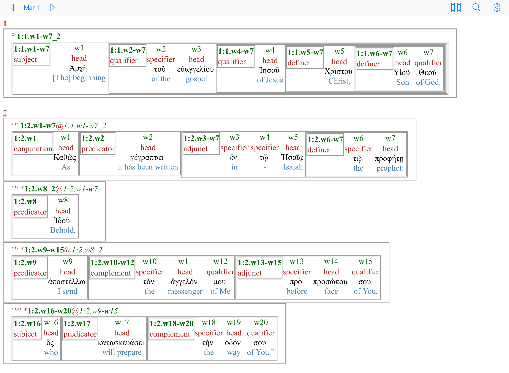
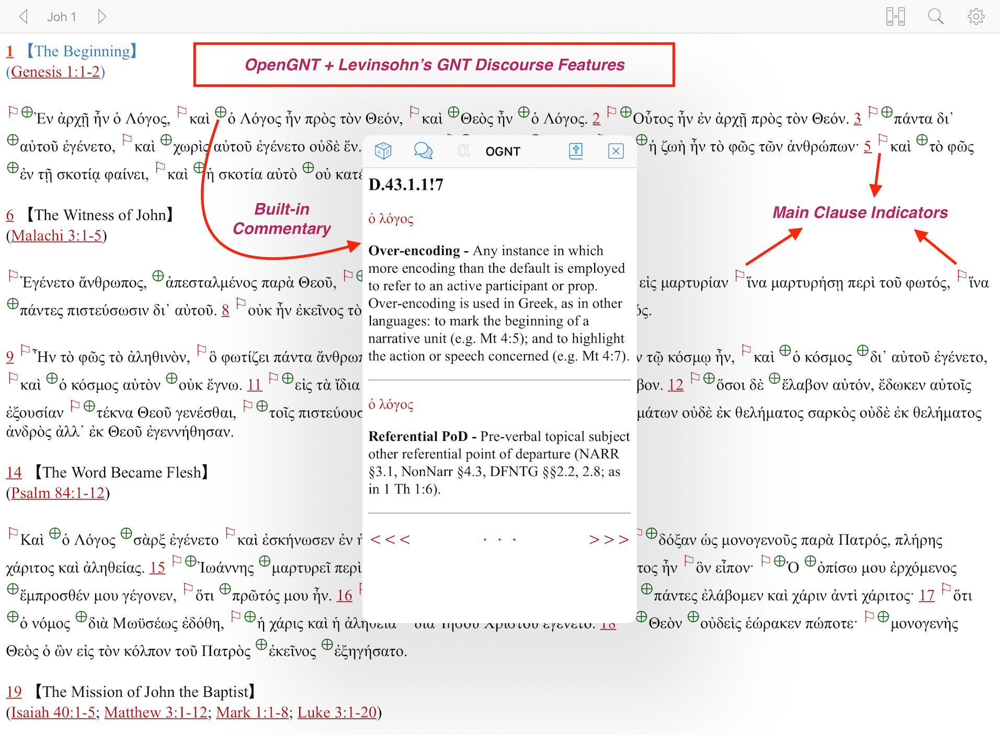
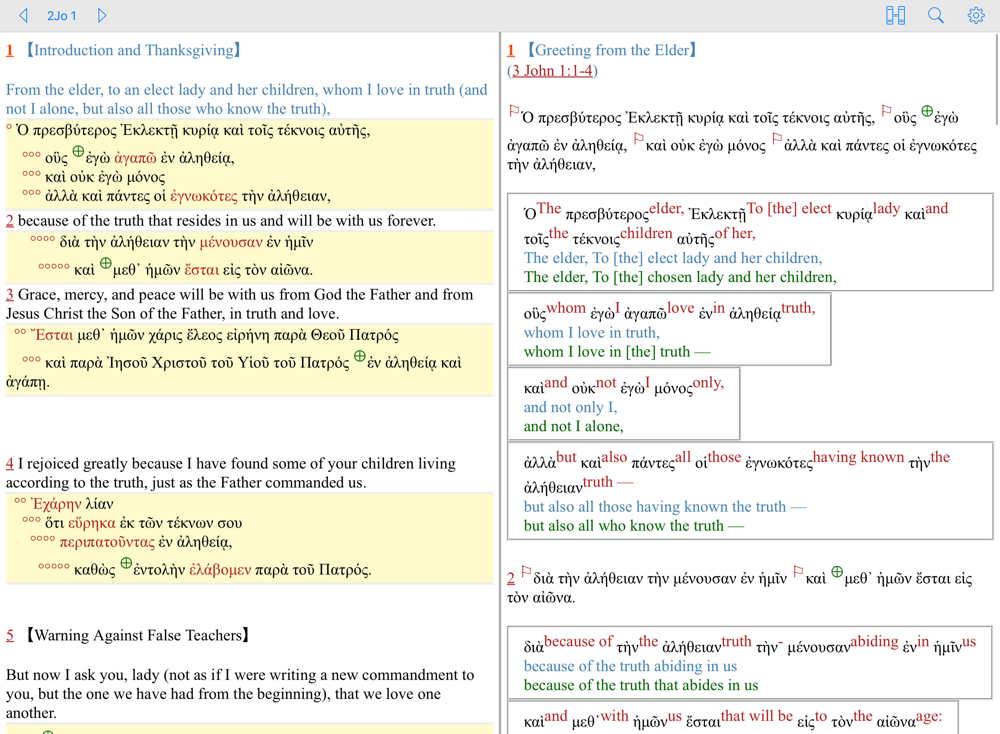
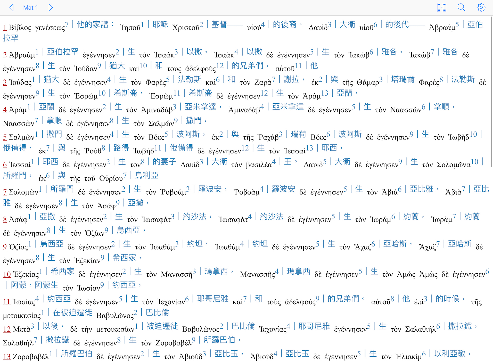
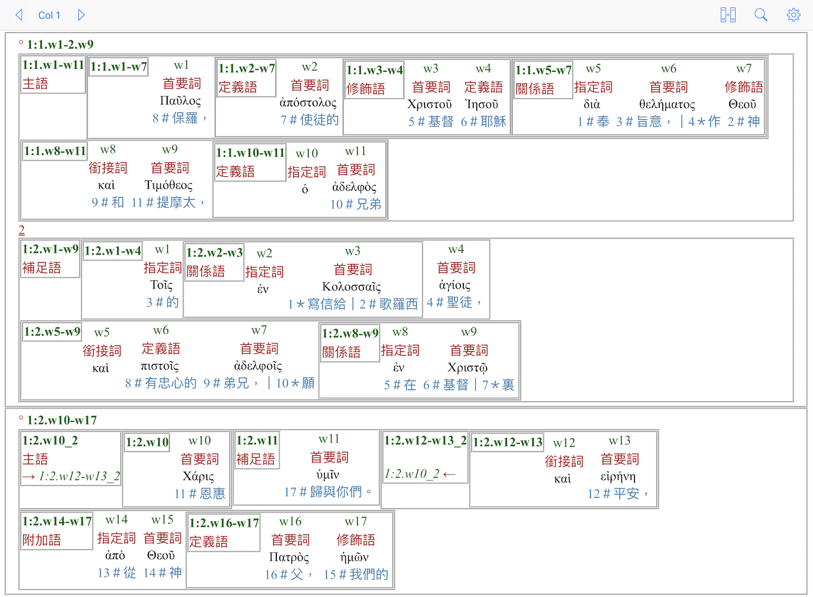

# NEW - Hebrew & Greek Word by Word Audio is now available online

Direct access at (no installation is required):

http://bible.gospelchurch.uk/index.html?cmd=text:::MIB

Hebrew examples: https://bible.gospelchurch.uk/index.html?cmd=bible%3A%3A%3AMIB%3A%3A%3AGen+1

Greek examples: https://bible.gospelchurch.uk/index.html?cmd=bible%3A%3A%3AMIB%3A%3A%3ARm+1

To access audio features, click the "music note" buttons, next to verse numbers of words.

# NEW - Audio MP3 Files on Open Hebrew Greek Bible

Faster speaking rate: https://github.com/eliranwong/MP3_OpenHebrewGreekBible_fast

Slower speaking rate: https://github.com/eliranwong/MP3_OpenHebrewGreekBible_slow

# Open Greek New Testament Project

[Open Hebrew Bible Project is now available at: <a href='https://github.com/eliranwong/OpenHB'>https://github.com/eliranwong/OpenHB</a>]  Fruits of both Open Greek New Testament Project and Open Hebrew Hebrew Project will be integrated together in a forthcoming <a href='https://Marvel.bible'>Marvel.bible</a>.

Open Greek New Testament Project aims to:
- offer <b>a FREE NA-equivalent text</b> of Greek New Testament, compiled from open-resources;
- align <b>a FREE NA-equivalent Greek New Testament</b> with a group of high-quality and open-source materials;
- develop an online reader for <b>FREE ACCESS</b> of major resources integrated in this project. [<a href='https://OpenGNT.com'>OpenGNT.com</a>]

The FREE NA-equivalent text is named as "<a href='https://github.com/eliranwong/OpenGNT/blob/master/OpenGNT_BASE_TEXT.zip'>Open Greek New Testament [OGNT]</a>".  The text of OGNT was built upon and compiled from a group of high-quality scholarly materials.  It serves as the base text for the rest of the project.  This provides all bible readers, students or scholars <b><a href='https://github.com/eliranwong/OpenGNT/blob/master/OpenGNT_BASE_TEXT.zip'>a FREE text of Greek New Testament</a></b>, which is <a href='https://github.com/eliranwong/OpenGNT/tree/master/CompareOGNTwithNA28'><b>the closest equivalent to the text of NA28 / NA27</b></a>, for studies or research purposes.
  
As <a href='https://github.com/eliranwong/OpenGNT/blob/master/OpenGNT_BASE_TEXT.zip'>the text of OGNT</a> is close to the text of NA28 / NA27, OGNT is a very good candidate for bridging a free Greek New Testament text with resources, which were originally keyed to the text of NA28 / NA27.  So far, Open Greek New Testament Project has successfully aligned <a href='https://github.com/eliranwong/OpenGNT/blob/master/OpenGNT_BASE_TEXT.zip'>the text of OGNT</a> with various scholarly resources, e.g. Tyndale Amalgamated NT Tagged texts, OpenText Linguisitic Annotations, Levinsohn Greek New Testament Features, Mounce Greek-English Dictionary, Berean interlinear translations, etc.

# Screenshot:

# Upgraded to Version 3

<b>25 August 2018:</b> The base text of OpenGNT project had been upgraded to version 3.  Previous versions, 1 & 2, are no longer supported.

There are 2 major files (file description is available <a href='https://github.com/eliranwong/OpenGNT/blob/master/fileDescription.md'>HERE</a>): 
- Base Text of OGNT: <a href='https://github.com/eliranwong/OpenGNT/blob/master/OpenGNT_BASE_TEXT.zip'>OpenGNT_BASE_TEXT.zip</a>
- Keyed Features and Mapping IDs: <a href='https://github.com/eliranwong/OpenGNT/blob/master/OpenGNT_keyedFeatures.csv.zip'>OpenGNT_keyedFeatures.csv.zip</a>

The base text of OpenGNT project, OGNT, is currently the closest equivalent to the text of NA28.

The base text and the rest of Open Greek New Testament Project is released under a public license described below.

Comparison between OGNT and NA28 is briefly described <a href='https://github.com/eliranwong/OpenGNT/tree/master/mapping_BGB/compare_OGNT_NA28'>HERE</a>.

# Source: A Brief History 

<b>Previous Versions (versions 1 & 2)</b>

Previous two versions of the base text of OpenGNT project were compiled from <a href='https://github.com/tyndale/STEPBible-Data/blob/master/TANTT%20-%20Tyndale%20Amalgamated%20NT%20Tagged%20texts.txt'>TANTT - Tyndale Amalgamated NT Tagged texts</a>.  They are now replaced by the latest version (version 3).  No support will be provided for the previous versions.

<b>The Latest Version (version 3)</b>

The latest base text of Open Greek New Testament Project, OGNT in short, was compiled from Berean Greek Bible and its associated database, which is primarily based on the Greek New Testament, <a href='https://sites.google.com/site/nestle1904/'>Η ΚΑΙΝΗ ΔΙΑΘΗΚΗ</a>, edited by Eberhard Nestle, published in 1904 by the British and Foreign Bible Society.

The Greek New Testament (Nestle, 1904) is now a public domain document worldwide, without any limitations for use or copyright issues.  <a href='https://berean.bible/committee.htm'>The Berean Bible Translation Committee</a> adopted it years ago as the base text for developing Berean Greek Bible and associated resources on New Testament.  

The final text of <a href='https://greekbible.org'>Berean Greek Bible</a> is primary based on Nestle Greek New Testament (1904), with modernisation of spellings and textual decisions reflecting the best and earliest manuscripts.  In addition, Berean translation table marks some significant textual variants of popular critical Greek New Testament editions, with <a href='https://greekbible.org'>a set of symbols</a>.

In August 2018, OpenGNT project was granted permission to integrate Berean Greek Bible and its associated data for compilation, mapping resources and distribution.

As the Greek New Testament (Nestle, 1904) shares the same heritage with later NA texts (e.g. NA27, NA28), it soon became obvious that Berean Greek data is a very good source for compiling a NA-equivalent text, which is free for both reading and mapping valuables resources based on NA27 / NA28.

<b>Compilation of the Base Text of OGNT</b>

Berean Greek Bible and its associated data (inclusive) were then taken into review and processed, for compilation of a NA-equivalent Greek New Testament.  The compilation process is briefly described below:

- Original variant markers in Berean database (inclusive) were reviewed, a few of them were refined. A few missing variants from Byzantine text were added to the database.  The were marked with "＋BYZ" in <a href='https://github.com/eliranwong/OpenGNT/blob/master/mapping_BGB/berean_tablesInclusive.csv.zip'>the database</a>, formatted for compilation.
- BGB was compared with <a href='https://github.com/greekcntr/BHP'>Bunning Heuristic Prototype Greek New Testament</a>, BHP in short, released by <a href='https://greekcntr.org'>Center for New Testament Restoration</a>.  The comparison considers major variants only, ignoring minor issues like movable ν, αλλ vs αλλα, etc.  BHP was taken into weighing textual decisions, as it is one of the latest projects, reflecting the best and earliest manuscripts.  The review results in adaptation of some BHP's readings in place of some BGB readings.  They were marked with "＋BHP" in <a href='https://github.com/eliranwong/OpenGNT/blob/master/mapping_BGB/berean_tablesInclusive.csv.zip'>the database</a>, formatted for compilation.  <i>Remarks:</i> BHP was not available for consideration in the original development of Berean Greek Bible, because it had not been published at the first launch of Berean Greek Bible.
- All TR, BYZ, WH, NE variants, originally marked in Berean database with symbols "{} ⧼⧽ () 〈〉", and some of SBL variants, marked with "〈〉", were taken away from the compilation.
- Verses containing ⇔ in original Berean database were reviewed and compared with other free GNT editons (i.e. TR, BYZ, WH, SBL, BHP).  Word order in 71 verses were adapted from other editions and were documented <a href='https://github.com/eliranwong/OpenGNT/blob/master/mapping_BGB/compare_OGNT_BGB/wordOrder_BGB_OGNT.tsv'>HERE</a>.
- Berean Greek Bible uses KJV versification.  Original GNT's versification (Nestle 1904) had been worked out, with minor variations following SBLGNT's versification.
- Original punctuation from the Berean database were not included in the compilation.

<b>Transparency</b>

- To ensure transparency, the original database for compilation, including Berean Greek Data, and additional data mentioned above, is uploaded <a href='https://github.com/eliranwong/OpenGNT/blob/master/mapping_BGB/source_BereanGreekBible_Inclusive.csv.zip'>HERE</a>.
- The process of the compilation is repeatable through the use of a simple Python script uploaded <a href='https://github.com/eliranwong/OpenGNT/blob/master/mapping_BGB/script/compileOGNT.py'>HERE</a>.  The script is provided for the sake of transparency.  In addition, it may be useful for validation or checking.

To use the script:
- unzip file "source_BereanGreekBible_Inclusive.csv.zip"
- place files "berean_tablesInclusive.csv" and "compileOGNT.py" in the same folder
- run command "python compileOGNT.py"

<b>A NA-Equivalent Text</b>

The <a href='https://github.com/eliranwong/OpenGNT/blob/master/OpenGNT_BASE_TEXT.zip'>resulting text</a> is suprisingly <a href='https://github.com/eliranwong/OpenGNT/tree/master/mapping_BGB/compare_OGNT_NA28'>very close to the text of NA28</a>.  Apart from minor orthographical variations, it only has a total of 61 words different from the text of NA28.  The text is now taken as the latest version (version 3) of the base text of Open Greek New Testament Project, replacing all previous versions.  It is not only the closest equivalent to the text of NA28 / NA27, but also <b>the best FREE candidate</b> for mapping resources originally keyed to NA28 / NA27, e.g. OpenText Linguistic Annotations, Levinsohn Greek New Testament discourse features.

<b>Comparison OGNT with NA28</b>

Comparison between OGNT and NA28 is briefly described <a href='https://github.com/eliranwong/OpenGNT/tree/master/mapping_BGB/compare_OGNT_NA28'>HERE</a>.

 

# License:

The main text of Open Greek New Testament Project, OGNT in short, is released under the following license:

 Open Greek New Testament Project by <a xmlns:cc="http://creativecommons.org/ns#" href="https://marvel.bible" property="cc:attributionName" rel="cc:attributionURL">Eliran Wong</a> is licensed under a <a rel="license" href="http://creativecommons.org/licenses/by-sa/4.0/">Creative Commons Attribution-ShareAlike 4.0 International License</a>. Based on a work at <a xmlns:dct="http://purl.org/dc/terms/" href="https://github.com/eliranwong/OpenGNT" rel="dct:source">https://github.com/eliranwong/OpenGNT</a>. Online Readers are available at <a href='https://marvel.bible'>https://Marvel.Bible</a> and <a href='https://OpenGNT.com'>https://OpenGNT.com</a>. Permissions beyond the scope of this license may be available at <a xmlns:cc="http://creativecommons.org/ns#" href="https://marvel.bible/contact/contactform.php" rel="cc:morePermissions">https://marvel.bible/contact/contactform.php</a>.
  
Information given for attribution:
  
 Open Greek New Testament Project by <a xmlns:cc="http://creativecommons.org/ns#" href="https://marvel.bible" property="cc:attributionName" rel="cc:attributionURL">Eliran Wong</a> is licensed under a <a rel="license" href="http://creativecommons.org/licenses/by-sa/4.0/">Creative Commons Attribution-ShareAlike 4.0 International License</a>. Based on a work at <a xmlns:dct="http://purl.org/dc/terms/" href="https://github.com/eliranwong/OpenGNT" rel="dct:source">https://github.com/eliranwong/OpenGNT</a>. Online Readers are available at <a href='https://marvel.bible'>https://Marvel.Bible</a> and <a href='https://OpenGNT.com'>https://OpenGNT.com</a>. Permissions beyond the scope of this license may be available at <a xmlns:cc="http://creativecommons.org/ns#" href="https://marvel.bible/contact/contactform.php" rel="cc:morePermissions">https://marvel.bible/contact/contactform.php</a>.

# Other Credits:

<b>STEPBible-Data</b>: 
"Tyndale House, Cambridge" [<a href='www.TyndaleHouse.com' target='_blank'>www.TyndaleHouse.com</a>], 
and "STEP Bible" [<a href='www.STEPBible.org' target='_blank'>www.STEPBible.org</a>] 
and source at <a href='tyndale.github.io/STEPBible-Data/' target='_blank'>tyndale.github.io/STEPBible-Data/</a>
  
<b>Bunning Heuristic Prototype Greek New Testament</b>: 
Bunning, Alan, ed. (2017) Bunning Heuristic Protoype Greek New Testament. Preliminary Draft, December 29, 2017.  <a href='https://github.com/greekcntr/BHP'>https://github.com/greekcntr/BHP</a>
  
<b>Berean Interlinear Bible</b> 
The Holy Bible, <a href='https://interlinearbible.com'>Berean Interlinear Bible</a>, BIB 
Copyright ©2016, 2018 by Bible Hub 
Used by Permission. All Rights Reserved Worldwide. 
<a href='berean.bible'>berean.bible</a> - Berean Bible Homepage 
<a href='interlinearbible.com'>interlinearbible.com</a> - Berean Interlinear Bible 
<a href='literalbible.com'>literalbible.com</a> - Berean Literal Bible 
<a href='bereanbible.com'>bereanbible.com</a> - Berean Study Bible 
<a href='emphasizedbible.com'>emphasizedbible.com</a> - Berean Emphasized Bible
  
<b>The OpenText.org Syntactically Annotated Greek New Testament</b> 
Stanley E. Porter 
Matthew Brook O'Donnell 
Jeffrey T. Reed 
Source: <a href='https://github.com/OpenText-org/GNT_annotation_v1.0' target='_blank'>GNT Annotation (version 1.0)</a> 
This annotation was completed in 2006 and was made available for viewing on the OpenText.org website and also implemented in Logos bible search software. 
The annotation data has been migrated to a new, inline XML format by Christopher Land and the base text has been corrected and updated to the NA28 by Christopher Land and Ryder Wishart.
  
<b>Levinsohn's Greek New Testament Discourse Features</b> 
Stephen Levinsohn's complete discourse features markup of the Greek New Testament (UBS4/NA27). This data was originally developed in BART and follow principles Levinsohn documented in his volume of Discourse Features of New Testament Greek. 
Source: <a href='https://github.com/biblicalhumanities/levinsohn'>https://github.com/biblicalhumanities/levinsohn</a> 
©2016 SIL International 
<a href='https://github.com/biblicalhumanities/levinsohn/blob/master/LICENSE.md'>License</a> 
Released by: 
Paul O'Rear 
Associate Coordinator 
International Translation 
SIL International
  
<b>NET Bible Copyright 2nd Edition (2017)</b> 
The NET Bible® verse text (no Notes) can be used by anyone and integrated into your non-commercial  project or publication upon condition of proper Biblical Studies Press copyright and organizational acknowledgments ... (<a href='http://netbible.com/net-bible-copyright' target='_blank'>http://netbible.com/net-bible-copyright</a>) 
Copyright and organizational acknowledgments: 
NET BIble® Copyright THE NET BIBLE®, New English Translation (NET) Scripture quoted by permission. Quotations designated (NET) are from the NET Bible® copyright ©1996-2016 by Biblical Studies Press, L.L.C. <a href='http://netbible.com' target='_blank'>http://netbible.com</a> All rights reserved.  The names: THE NET BIBLE®, NEW ENGLISH TRANSLATION COPYRIGHT (c) 1996 BY BIBLICAL STUDIES PRESS, L.L.C. NET Bible® IS A  REGISTERED TRADEMARK THE NET BIBLE® LOGO, SERVICE MARK COPYRIGHT (c) 1997 BY BIBLICAL STUDIES PRESS, L.L.C. ALL RIGHTS RESERVEDSATELLITE IMAGERY COPYRIGHT (c) RØHR PRODUCTIONS LTD. AND CENTRE NATIONAL D'ÉTUDES SPATIALES PHOTOGRAPHS COPYRIGHT (c) RØHR PRODUCTIONS LTD.
  
<b>The CHINESE STANDARD BIBLE© Simplified and Traditional texts</b> 
The CHINESE STANDARD BIBLE© Simplified and Traditional texts and audio versions of the same, Copyright © 2005, 2008, 2011 by Global Bible Initiative are licensed under the Creative Commons Attribution-Non Commercial-No Derivatives 4.0 International License. To view a copy of this license, visit <a href='http://creativecommons.org/licenses/by-nc-nd/4.0/'>http://creativecommons.org/licenses/by-nc-nd/4.0/</a>  or send a letter to Creative Commons, PO Box 1866, Mountain View, CA 94042, USA.  Permissions beyond the scope of this license may be available and may be requested by contacting <a href='mailto:Permissions@GlobalBibleInitiative.org'>Permissions@GlobalBibleInitiative.org</a> 
Learn More at <a href='https://www.globalbibleinitiative.org/'>https://www.globalbibleinitiative.org/</a> 
<b>Remarks: </b> OpenGNT project confirmed with Ken Stephens, Director of Publishing and Donor Engagement of Global Bible Initiative, that aligning the text of CSB with a Greek text, without changing its wordings, is permitted.
  
<b>Chinese Equivalent Koine Grammar And Syntax</b> 
<b>中文代表字原文新約聖經</b> 
<b>基礎文法 及 經文結構分析</b> 
Copyright 2005~2018 by BRSI 
(聖經研讀學會 Bible Research Study Institute) 
Permission to all Christians for use, study or share. 
Source: <a href='http://www.ssjcbc.com/bibleresearch/bible_reaserch2.html'>http://www.ssjcbc.com/bibleresearch/bible_reaserch2.html</a>
  
<b>Chinese translation by <a href='https://github.com/stephen-ku'>Stephen Ku</a> and Eliran Wong</b> 
RMAC's description 
OpenText Linguistic Annotations
  
<b>Korean translation by Kevin Kim</b> 
RMAC's description
  
<b>Mounce Concise Greek-English Dictionary</b> 
Source: <a href='https://github.com/billmounce/dictionary'>https://github.com/billmounce/dictionary</a> 
Used with the following attribution: 
Mounce Concise Greek-English Dictionary 
Copyright 1993 All Rights Reserved 
www.teknia.com/greek-dictionary
  
<b>Spanish Literal Translation</b> 
La traducción al español fue mapeada y ajustada por E. Barrientos al texto del Proyecto OGNT del módulo para el Programa E-Sword del Proyecto GALEED 2017 "Una traducción literal palabra por palabra al español" auspiciado por Biblioteca Hispana, Última Revisión: 01 de febrero de 2017 que contiene una traducción literal del Texto Griego Maestro NA27. 
[The translation into Spanish was mapped and adjusted by E. Barrientos to the text of the OGNT Project of the module for the E-Sword Program of the GALEED Project 2017 "A literal translation word for word into Spanish" sponsored by Biblioteca Hispana, Last Revision: February 1 of 2017 that contains a literal translation of the Greek Text Master NA27.]
  
<b>Morphological Lexicon of the Greek New Testament</b> 
Source: <a href='https://github.com/morphgnt/morphological-lexicon'>https://github.com/morphgnt/morphological-lexicon</a> 
It is used to process data for mapping purpose.
  
<b>The Copenhagen Alliance for Open Biblical Language Resources</b> 
<a href='http://copenhagen-alliance.org'>http://copenhagen-alliance.org</a> 
Advice about licensing. 

# Enhancement / Forthcoming additions:

- OGNT mapped to Berean Interlinear Translation - <a href='https://github.com/eliranwong/OpenGNT/blob/master/OpenGNT_BASE_TEXT.zip'>DONE!</a> 
- transliteration (according to SBL guide) - <a href='https://github.com/eliranwong/OpenGNT/blob/master/OpenGNT_BASE_TEXT.zip'>DONE!</a> 
- modern Greek pronunciation guide - <a href='https://github.com/eliranwong/OpenGNT/blob/master/OpenGNT_BASE_TEXT.zip'>DONE!</a> 
- an analytical lexicon containing all words of OpenGNT text - <a href='https://github.com/eliranwong/OpenGNT/blob/master/Lexicons/OGNT-Analytical_Lexicon.csv'>DONE!</a> 
- a full set of context-sensitive glosses for OpenGNT [<a href='https://github.com/eliranwong/OpenGNT/blob/master/OpenGNT_keyedFeatures.csv.zip'>Find regular updates HERE</a>; read file description <a href='https://github.com/eliranwong/OpenGNT/blob/master/README.md#main-file'>HERE</a>.]
- mapping GK numbers (mapped with <a href='https://github.com/billmounce/dictionary'>Mounce's Concise Greek-English dictionary</a>) - <a href='https://github.com/eliranwong/OpenGNT/blob/master/OpenGNT_keyedFeatures.csv.zip'>First draft; CHECKING in progress</a> 
- mapping Louw-Nida numbers (numbers only, not copyrighted materials) - <a href='https://github.com/eliranwong/OpenGNT/blob/master/OpenGNT_keyedFeatures.csv.zip'>First draft; CHECKING in progress</a> 
- mapping BDAG catchwords (catchwords only, not copyrighted materials) - <a href='https://github.com/eliranwong/OpenGNT/blob/master/OpenGNT_keyedFeatures.csv.zip'>First draft; CHECKING in progress</a> 
- mapping EDNT catchwords (catchwords only, not copyrighted materials) - <a href='https://github.com/eliranwong/OpenGNT/blob/master/OpenGNT_keyedFeatures.csv.zip'>First draft; CHECKING in progress</a> 
- mapping <a href='https://github.com/billmounce/dictionary' target='_blank'>Mounce's NT dictionary</a> - <a href='https://github.com/eliranwong/OpenGNT/blob/master/OpenGNT_keyedFeatures.csv.zip'>DONE!</a> 
- mapping <a href='https://github.com/OpenText-org/GNT_annotation_v1.0' target='_blank'>OpenText annotations</a> - <a href='https://github.com/eliranwong/OpenGNT/blob/master/OpenGNT_keyedFeatures.csv.zip'>DONE!</a> 
- creating a html template for visual presentation of OpenText annotations - <a href='https://github.com/eliranwong/OpenGNT/blob/master/mapping_OpenTextAnnotations/OpenText_v1_formatted_in_HTML.csv.zip'>DONE!</a> 
- mapping <a href='https://github.com/biblicalhumanities/levinsohn' target='_blank'>Levinsohn's GNT Discourse Features</a> - <a href='https://github.com/eliranwong/OpenGNT/blob/master/OGNT_FullMapping_Levinsohn.csv.zip'>DONE!</a>; Full mapping is availalbe <a href='https://github.com/eliranwong/OpenGNT/blob/master/mapping_LevinsohnGNTDF/OGNT_FullMapping_Levinsohn.csv.zip'>HERE</a> 
- tagging the text of OGNT with <a href='https://github.com/eliranwong/OpenGNT/blob/master/mapping_LevinsohnGNTDF/OGNT_FullMapping_Levinsohn.csv.zip'>Levinsohn GNT discourse features</a>, like <a href='https://github.com/biblicalhumanities/levinsohn/blob/master/LGNTDF/Main_clauses.xml'>main clauses</a>, <a href='https://github.com/biblicalhumanities/levinsohn/blob/master/LGNTDF/OT_quotes.xml'>OT quotations</a>, <a href='https://github.com/biblicalhumanities/levinsohn/blob/master/LGNTDF/Reported_Speech.xml'>reported speeches</a>, <a href='https://github.com/biblicalhumanities/levinsohn/blob/master/LGNTDF/EmbeddedRepSpeech.xml'>embedded reported speeches</a>, etc. - <a href='https://github.com/eliranwong/OpenGNT/blob/master/OpenGNT_keyedFeatures.csv.zip'>DONE!</a> 
- mapping <a href='http://www.ssjcbc.com/bibleresearch/bible_reaserch2.html'>Chinese Equivalent Koine Grammar And Syntax</a> - <a href='https://github.com/eliranwong/OpenGNT/blob/master/mapping_BRSI/OGNTmappingCEKGAS.csv'>DONE</a>
- mapping bible translation "<a href='http://netbible.com/' target='_blank'>The NET Bible® verse text (no Notes) - 2nd Edition; New Testament</a>" --- <a href='https://github.com/eliranwong/OpenGNT/blob/master/OpenGNT_interlinear_NET2.csv.zip'>2nd screening in progress</a> 
- mapping bible translation "<a href='http://chinesestandardbible.com'>The CHINESE STANDARD BIBLE© Simplified and Traditional texts</a>" --- <a href='https://github.com/eliranwong/OpenGNT/blob/master/OpenGNT_interlinear_CSBtc.csv.zip'>First draft; CHECKING in progress</a> 
- mapping bible translation "Chinese Union Version" --- <a href='https://github.com/eliranwong/OpenGNT/blob/master/OpenGNT_interlinear_CUVtc.csv.zip'>First draft; CHECKING in progress</a> 
- more ... you are welcome to suggest other features at <a href='https://biblebento.com/contact/contactform.php' target='_blank'>https://biblebento.com/contact/contactform.php</a>

# Modules for Software Applications

Modules based on OpenGNT project are released gradually for use with bible applications.  They are made available in folder "<a href='https://github.com/eliranwong/OpenGNT/tree/master/Modules_for_Bible_Applications'>Modules_for_Bible_Applications</a>"
  
If you are a software developer and interested in this project, you are welcome to <a href='https://biblebento.com/contact/contactform.php' target='_blank'>contact us</a>.
  

  

  

